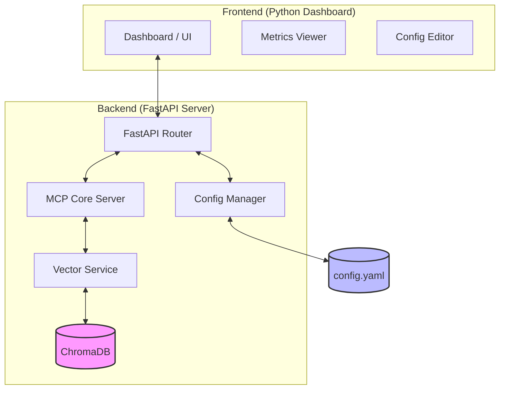

# Architecture: FastAPI_MCP_PoC

## Key Components

1.  **Dashboard (Frontend)**: For monitoring, editing configurations, and visualizing knowledge base queries.
2.  **FastAPI Router (Backend)**: Orchestrates requests between the UI and the MCP/Vector services.
3.  **MCP Core**: Implements the Model Context Protocol, exposing tools to AI clients.
4.  **Vector Service**: Provides RAG (Retrieval-Augmented Generation) capabilities using ChromaDB.
5.  **Config Manager**: Handles dynamic updates to `config.yaml`.
